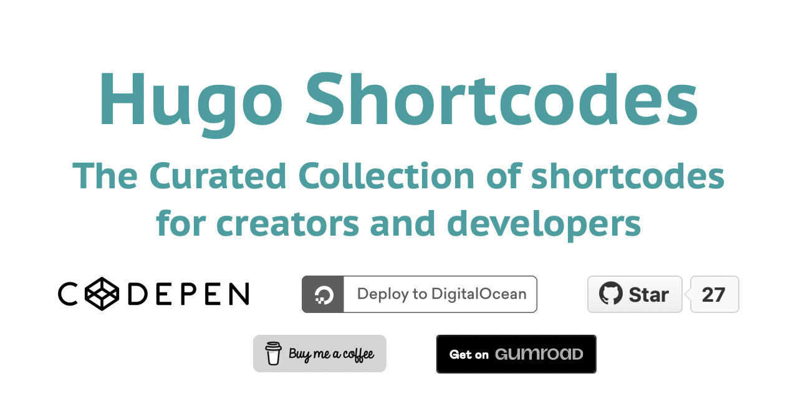

# Hugo Shortcodes

[](https://gohugo.io)
[](LICENSE)



## What are shortcodes

> Shortcodes are simple snippets inside your content files calling built-in or custom templates.

See [documentation website](https://isqua.github.io/hugo-shortcodes/) to find some pieces of code which may help you deliver content faster.

## How to use shortcodes

Before using a shortcode in your own Hugo website, you have to plug their code into your site.

### Install all shortcodes at once as a theme

If you need dozens of them, it’s better to attach this repository as a theme to your website.

First, add the theme as a git submodule:

```
git submodule add -b theme https://github.com/isqua/hugo-shortcodes.git themes/hugo-shortcodes
```

Then add the theme to your `config.toml`. Most likely you have the following line in your config:

```
theme = 'ananke'
```

*There may be another theme in place of “ananke”*.

Then surround the theme with square brackets, and appends `'hugo-shortcodes'` with a comma at the end:

```
theme = [ 'ananke', 'hugo-shortcodes' ]
```

That’s it! If your hugo server is running, it is better to restart it to avoid unexpected behavior.

Now you can use all the shortcodes on any content page of your site.

### Install only a few shortcodes

If you need only one or a few shortcodes, you may follow easiest way:

1. First, [find the shortcode](https://isqua.github.io/hugo-shortcodes/) you need.
1. Scroll the shortcode page down.
1. Click on the “Install only current shortcode” button.
1. Follow the instructions.

That’s it! If your hugo server is running, it is better to restart it to avoid unexpected behavior.

Now you can use the shortcode on any content page of your site.

----

Have any questions? Open issue or contant me: [isqua@isqua.ru](mailto:isqua@isqua.ru?subject=Hugo%2BShortcodes).
